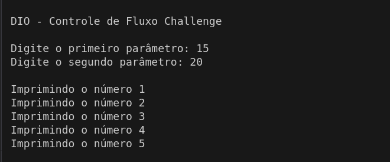

# DIO - Controle de Fluxo

 

## Descrição

Desafio de projeto que consiste em usar fluxos condicionais, repetições e excepcionais em Java. A descrição completa pode ser encontrada em [Controle de Fluxo - Desafio](https://github.com/digitalinnovationone/trilha-java-basico/tree/main/desafios/controle-fluxo).

## Cenário

- O sistema deve aceitar dois números inteiros como entrada e obter a quantidade de interações, que será a diferença entre os dois números;
- Para cada interação, o sistema deve imprimir o número da interação e incrementa-lo a cada passo do laço `for`;
- O sistema deve lançar a exceção `ParametrosInvalidosException` com a mensagem **"O segundo parâmetro deve ser maior que o primeiro"** caso o primeiro parâmetro seja <mark>maior</mark> que o segundo parâmetro.

## Instalação e Uso

Faça o download do projeto e execute o arquivo `DesafioControleFluxo/src/Contador.java`, forneça valores quando solicitado e observe a saída. Caso desejar, tente as seguintes entradas:

- 15 e 20
- 20 e 15 (Será lançada a exceção `ParametrosInvalidosException`, pois o primeiro número é maior que o segundo)
- 5 e ABCD (Sera lançada a exceção `InputMismatchException`, pois o segundo parâmetro nesse exemplo não é um número inteiro)
